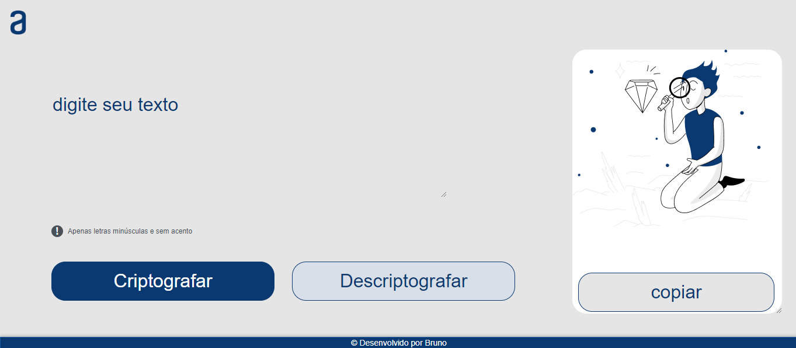
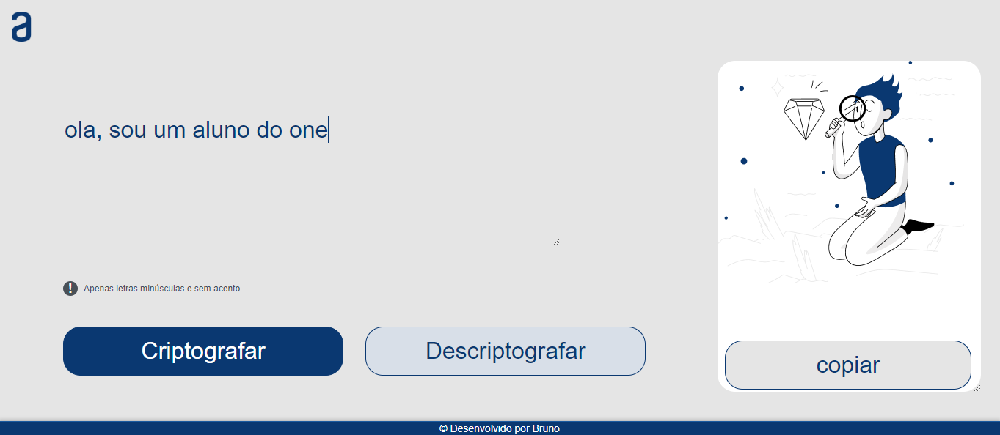
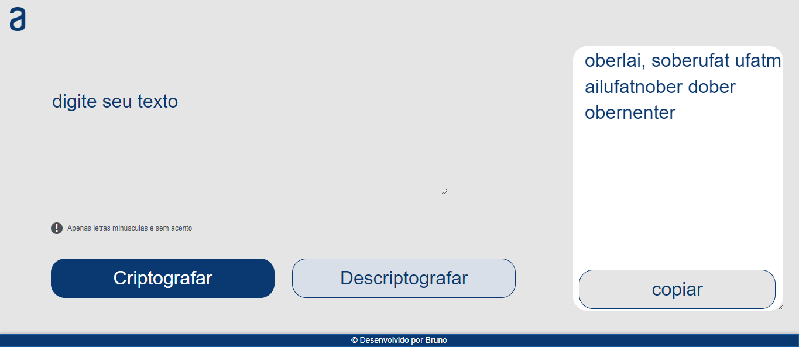
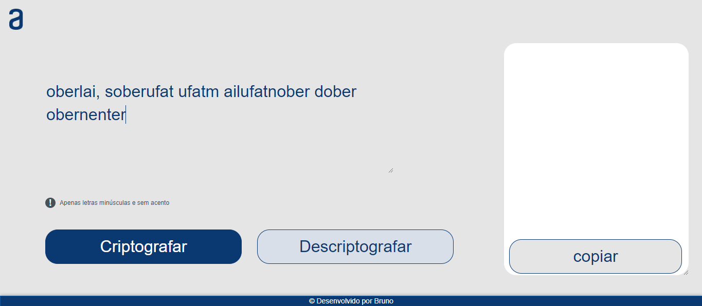
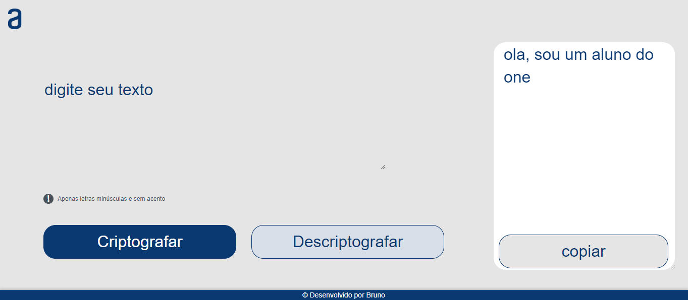

# Projeto Decodificador de Texto
Esse é um Decodificador de textos, ele foi desenvolvido em HTML, CSS e Javascript.
Ele permite que o usuário encripte e desencripte mensagens de acordo com uma tabela de substituição específica.

FUNCIONALIDADES

- Encriptar: Recebe o texto inserido pelo usuário e faz a encriptação, substituindo as vogais por códigos específicos.
- Desencriptar: Faz com que o texto encriptado volte para sua forma original.
- Copiar texto: Copia o Texto encriptado ou desencriptado para a área de tansferência.
- Validação de texto: O programa filtra automaticamente a entrada de texto do usúario, não permitindo acentos e caracteres inválidos, aceitando apenas letras minúsculas, pontos, vírgulas e espaços.

COMO UTILIZAR

1- Inserir o texto que deseja que seja encriptado ou desencriptado na área de texto.

2- Clique no botão "Criptografar" para encriptar o texto de acordo com as regras definidas na tabela.

    A letra "e" é convertida para "enter"
    A letra "i" é convertida para "imes"
    A letra "a" é convertida para "ai"
    A letra "o" é convertida para "ober"
    A letra "u" é convertida para "ufat"

3- Clique no botão "Copiar" para copiar o texto para a área de transferência.

4- Coloque o texto encriptado no campo de texto e clique no botão "Descriptografar" para reverter o texto para a forma original.

5- Assim o texto volta para sua forma original, desencriptado.

COMO EXECUTAR

1- Faça o download ou clone o repositório.

2- Abra o arquivo index.html no seu navegador de internet.